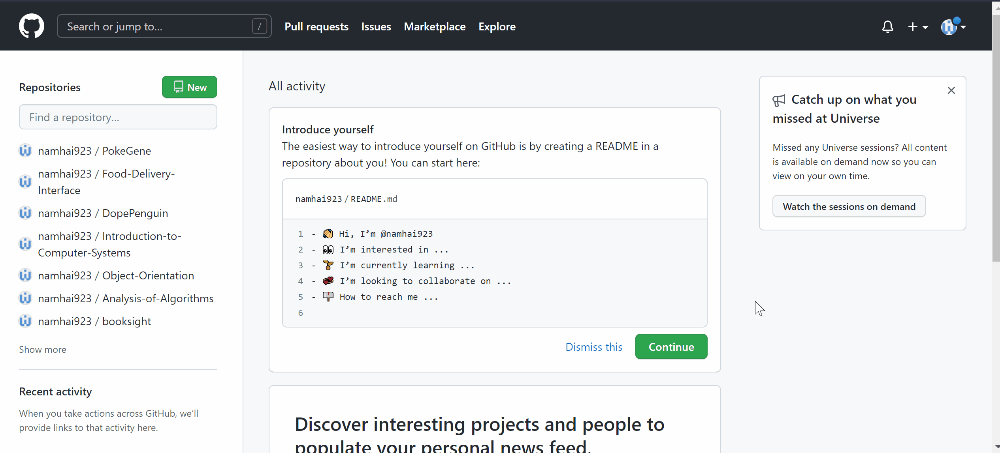
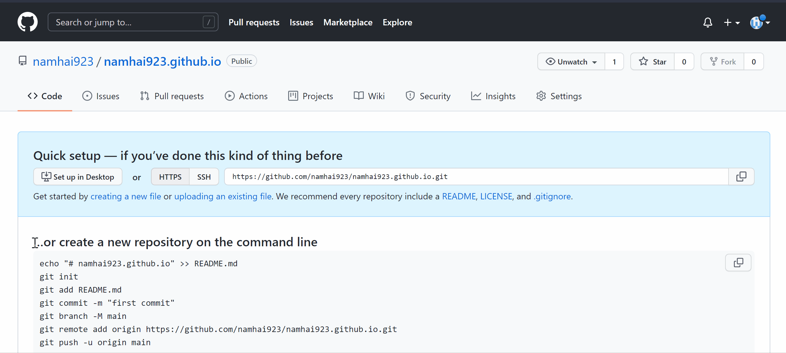
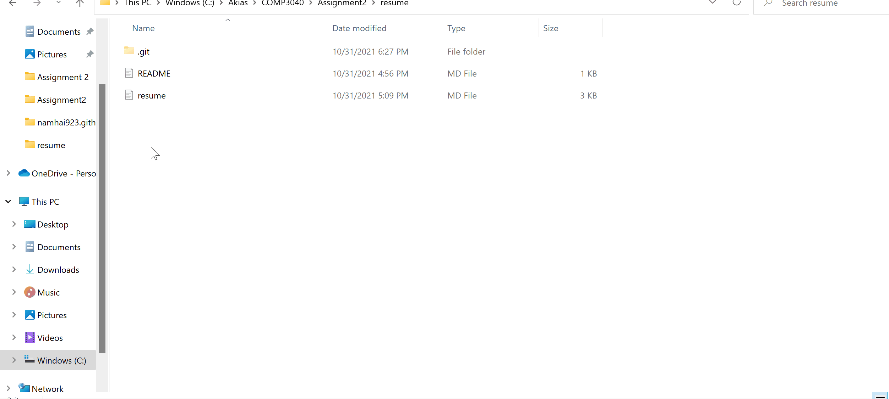
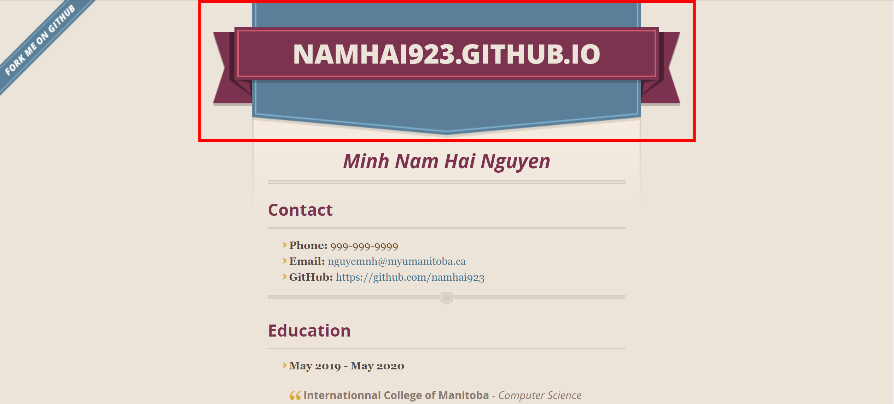

# Hosting your resume on GitHub Pages

#### Resume is an important tool where you can display your skills and qualities to your employers. However, sending your pdf resume to multiple employers is tedious and ineffective. Imagine that you forgot to update your resume, then you have to resend your resume to employers again, which is annoying. In this guide, we will discuss how to create a resume-website using Jekyll and GitHub Pages. After that, you just need to send the URL path to your employers and you can still update your resume-website using GitHub. This might also be an opportunity to show your technology skills to your employers.
<br>

> This guide assumes that you already have a resume formatted in Markdown. If you haven't, you should go through this [Markdown tutorial](https://www.markdowntutorial.com/) and create your Markdown resume using a Markdown editor. Here is the list of some [Markdown editors](https://sourceforge.net/software/markdown-editors/) that I think you should use.

## Steps to host a resume on GitHub Pages

1. **_Installing and setting up Git on your computer_**  
    To connect to GitHub, you will need to have Git installed on your computer, you can download it [here](https://git-scm.com/downloads). After Git is installed, you should make some configuration by running these commands in your Command Prompt:  

    ```
    git config --global user.name "<Your name>"
    git config --global user.email "<Your email>"
    ```

    Etter mentions in his book that developers prefer distributed version control systems (DVCS) like Git because they allow for offline work, and are superior to centralized systems for concurrent work on the same file. For that reason, as a Computer Science student, you will need to get familiar with Git sooner or later.

2. **_Setting up a GitHub account_**  
    In order to use GitHub Pages, obviously you will need a [GitHub](https://github.com/) account to upload your resume and other supported files that we will discuss later.  
    <br>
    From Etter's book, static websites are fast, simple and secure. They can be hosted anywhere, including Amazon S3 and GitHub Pages. They have no server-side application dependencies, no databases, and nothing to install, so migrating the entire site is as easy as moving a directory.

3. **_Creating and connecting to a GitHub repository_**  
    GitHub repository is your web files storage. GitHub Pages will use this storage to create your resume-website. To create a GitHub repository your need to:  
    - Click the `New` button on the left of the main page
    - On the new repository screen, fill in the name for your new repository
    - If the name of your repository is `<username>.github.io` then your resume-website will use that name as its URL path. Otherwise, your resume-website will use `github.com/<username>/<repository's name>` as its URL path
    - Click `Create repository` to finish creating your GitHub repository
    

    To be able to upload files from your computer to your remote GitHub repository, you must connect a folder in your computer to a GitHub repository. To connect to your GitHub repository you need to:  
    - Copy every commands that are specified under **…or create a new repository on the command line** and run them in Command Prompt
    - Create an empty folder on your computer which will store all the files that you want to upload to GitHub repository
    - Open Command Prompt then redirect to the folder that you just create
    
    - Finally, enter your GitHub credentials if they are required  
    <br>

    According to Etter's book, to create a static website, you will need a remote repository and push the finished site to it. GitHub Pages will use your remote repository as a production server. So that your website will be updated easily based on your remote repository: adding new files, updating existing files and deleting stale files.
4. **_Uploading your resume to GitHub_**  
    GitHub Pages will use all the files in the GitHub repository to create a website. Renaming your resume to `index.md` before uploading it to GitHub repository since GitHub Pages will use the content on that file as the content of the website. To upload your files you need to:
    - Put all the files you need to upload in the connected folder
    - Open Command Prompt at that folder and run:
        ```
        git add .
        git commit -m"<commit's message>"
        git push
        ```
    - Reload GitHub to check that your files are uploaded on GitHub repository
    

    To make sure that your resume is displayed as you expect, you should use GitHub Flavored Markdown (GFM). You can also use "vanilla" Markdown but it only has a limited set of features. Etter also recommend using GFM in his book:
    > Using only "vanilla" Markdown syntax allows for broad compatibility, but you miss out on features like tables and "fenced" code blocks. Using a flavor of Markdown means you might have to rework your source files if you ever want to switch to a different flavor, but the level of effort in such a switch would likely be low. GitHub Flavored Markdown is a popular and fine choice for simple web-based help systems.

5. **_Hosting resume on GitHub Pages_**
    After your resume is uploaded to your GitHub repository, you can now use GitHub Pages' features to create a resume-website. To host a resume on GiHub Pages you need to:
    - Open the **Settings** tab
    - On the settings page, choose the **Pages** section in the table on the left
    - Under **Source**, choose **main** branch then click **Save** button
    - Under **Theme Chooser**, click **Choose a theme** button to start creating your website
    - You will see several theme options in the carousel at the top of Theme Chooser page. Click on those options to preview the themes
    - When you get your favorite one, click **Select theme** button to finish choosing theme and redirect back to the GitHub Pages page
    - When you see a notification from GitHub **Your site is ready to be published at `<URL path>`** on GitHub Pages page, click on that URL path and keep reloading the site since it will take a while for GitHub to host it
    

    The reason for having a resume-website is better than a resume pdf is that it is easier to update and you need to keep your resume up to date. Etter also mentions about this in his book: 
    > PDFs get downloaded onto hard drives and then sit there like day-old bagels, growing more and more stale until they're actively harmful. You can never update them. Hosting your content on a website gives you the power to fix inaccuracies almost instantly and keep your content in sync with the latest software release".

6. **_Removing header from your resume-website (Optional)_**  
You already have your resume hosted on a website using GitHub Pages. However, there is a header in the theme options that are provided by GitHub Pages.
To make your website looks nicer by removing that header you need to: 
    - Create a file `/assets/css/style.scss` with content:
        ```
        ---
        ---
        
        @import "{{ site.theme }}"

        header {
            display: none;
        }
        ```
    - Follow step 5 to upload this change in your folder to your remote GitHub repository.
    - Keep reloading your resume-website since GitHub will take a while to update your site.


7. **_Using a jekyll theme not on GitHub Pages (Optional)_**  
In addition to all the theme options that are listed in GitHub Pages, there are many Jekyll themes out there that are compatible with GitHub Pages. You can find many themes at [Jekyll themes](https://jekyllthemes.io/) and choose the one that is suitable for you. Each theme has a different setup and usage so you need to take some time reading its documentation to know how to use it.

## More Resources

- [Markdown overview](https://www.markdownguide.org/getting-started)
- [Markdown tutorial](https://www.markdowntutorial.com/)
- [GitHub Pages overview](https://docs.github.com/en/pages/getting-started-with-github-pages/about-github-pages)
- [Andrew Etter - Modern Technical Writing_ An Introduction to Software Documentation](https://www.amazon.com/Modern-Technical-Writing-Introduction-Documentation-ebook/dp/B01A2QL9SS)

## Authors and Acknowledgment

Thanks to Andrew Etter for an amazing book about technical writing which gives me motivation to write this instruction.

## FAQs

- Why is Markdown better than a word processor?
    > You can read this [Markdown overview](https://www.markdownguide.org/getting-started) to know more about the reason why it is better than a word processor.
- Why is my resume not showing up?
    > Maybe you didn't follow all the steps correctly, the mistake that users often encounter is forgetting to rename resume to `index.md`. My advice is that you should go through all the steps one more time to make sure that you didn't make any mistake.